# Arquitectura Interactiva de Alisys Web Bot

## Diagrama de Componentes

## Flujo de Procesamiento de Mensajes

## Jerarquía de Clases del Sistema de Agentes

## Arquitectura de Servicios y Utilidades

```mermaid
classDiagram
    class LMStudioClient {
        +api_base: string
        +api_key: string
        +model: string
        +generate_stream(system_prompt, user_message): Generator
        +generate(system_prompt, user_message): string
        +check_connection(): bool
    }
    
    class ContextPersistenceManager {
        +storage_dir: string
        +save_context(user_id, context): bool
        +load_context(user_id): Dict
        +list_user_sessions(user_id): List[Dict]
        -_get_user_storage_path(user_id): string
        -_get_session_file_path(user_id, session_id): string
    }
    
    class SentimentAnalyzer {
        +analyze(message): Dict
        +get_response_suggestion(analysis): Dict
        -_detect_emotions(message): Dict
        -_calculate_polarity(message): float
        -_detect_urgency(message): float
    }
    
    class IntentClassifier {
        +classify_intent(message, context): Dict
        +detect_agent_change_keywords(message): string
        +get_confidence_explanation(scores, agent_name): string
    }
    
    class DataManager {
        +save_lead(lead_data): bool
        +get_leads(): List[Lead]
        +get_lead_by_id(lead_id): Lead
        +update_lead(lead_id, updated_data): bool
    }
```

## Descripción de los Componentes Principales

### Sistema de Agentes

- **AgentManager**: Coordina el sistema de agentes, seleccionando el más adecuado para cada mensaje y gestionando el contexto de la conversación.
- **BaseAgent**: Clase abstracta que define la interfaz común para todos los agentes.
- **GeneralAgent**: Maneja consultas generales sobre Alisys y sus servicios.
- **SalesAgent**: Especializado en proporcionar información sobre precios y cotizaciones.
- **EngineerAgent**: Proporciona estimaciones de tiempo y recomendaciones técnicas.
- **DataCollectionAgent**: Se encarga de recopilar información de contacto del usuario.
- **WelcomeAgent**: Da la bienvenida a los usuarios y proporciona información inicial.

### Servicios

- **LMStudioClient**: Cliente que se conecta a LM Studio para generar respuestas utilizando un modelo de lenguaje compatible con la API de OpenAI.

### Utilidades

- **ContextPersistenceManager**: Gestiona la persistencia del contexto de conversación entre sesiones.
- **SentimentAnalyzer**: Analiza el sentimiento del mensaje del usuario para adaptar la respuesta.
- **IntentClassifier**: Clasifica la intención del mensaje para seleccionar el agente adecuado.

### Almacenamiento

- **DataManager**: Gestiona el almacenamiento y recuperación de datos de leads.
- **Database**: Base de datos SQLite para almacenar leads y otra información.

### API Layer

- **Routes**: Define las rutas y endpoints de la API del chatbot.
- **AgentRoutes**: Rutas específicas para el sistema de agentes.

### Interfaz de Usuario

- **Frontend Web**: Interfaz web responsive que permite a los usuarios interactuar con el chatbot.

## Flujos de Usuario

1. **Consulta General**:
   - Usuario envía una pregunta sobre servicios de Alisys
   - GeneralAgent proporciona información detallada

2. **Consulta de Precios**:
   - Usuario pregunta por precios o cotizaciones
   - SalesAgent proporciona información sobre precios y opciones

3. **Consulta Técnica**:
   - Usuario pregunta aspectos técnicos de implementación
   - EngineerAgent proporciona información técnica detallada

4. **Recopilación de Datos**:
   - Después de mostrar interés, el DataCollectionAgent solicita información de contacto
   - Se guardan los datos en la base de datos para seguimiento 