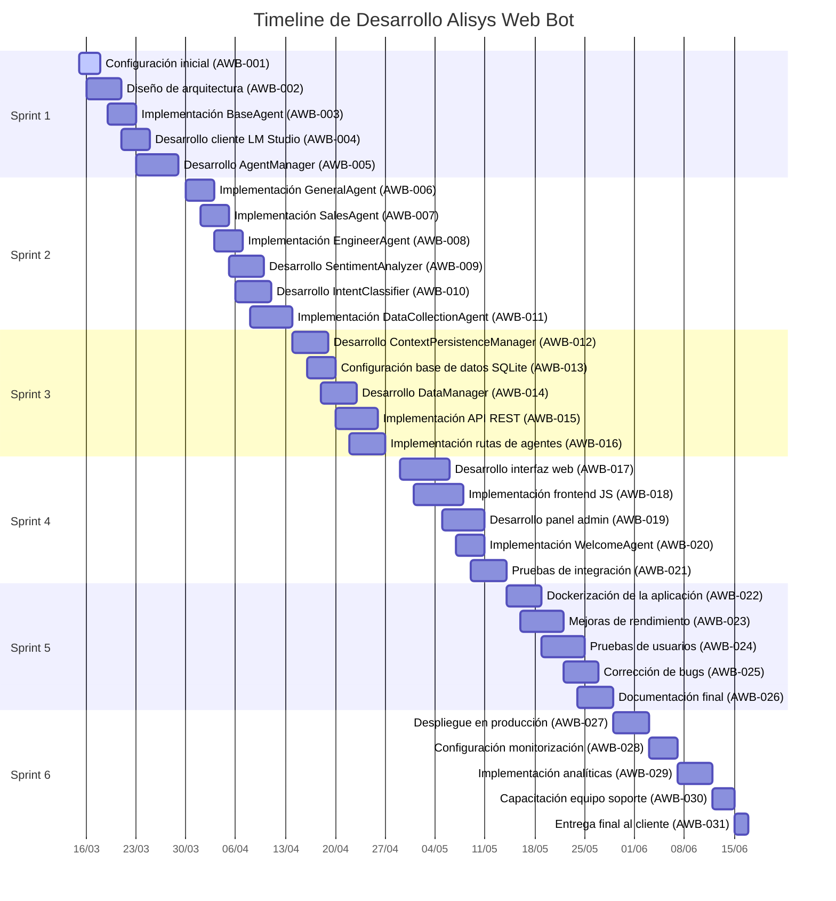

```mermaid
gantt
    title Timeline de Desarrollo Alisys Web Bot
    dateFormat  YYYY-MM-DD
    axisFormat %d/%m
    
    section Sprint 1
    Configuración inicial (AWB-001)      :active, a1, 2025-03-15, 3d
    Diseño de arquitectura (AWB-002)     :a2, 2025-03-16, 5d
    Implementación BaseAgent (AWB-003)   :a3, 2025-03-19, 4d
    Desarrollo cliente LM Studio (AWB-004) :a4, 2025-03-21, 4d
    Desarrollo AgentManager (AWB-005)    :a5, 2025-03-23, 6d
    
    section Sprint 2
    Implementación GeneralAgent (AWB-006) :b1, 2025-03-30, 4d
    Implementación SalesAgent (AWB-007)  :b2, 2025-04-01, 4d
    Implementación EngineerAgent (AWB-008) :b3, 2025-04-03, 4d
    Desarrollo SentimentAnalyzer (AWB-009) :b4, 2025-04-05, 5d
    Desarrollo IntentClassifier (AWB-010) :b5, 2025-04-06, 5d
    Implementación DataCollectionAgent (AWB-011) :b6, 2025-04-08, 6d
    
    section Sprint 3
    Desarrollo ContextPersistenceManager (AWB-012) :c1, 2025-04-14, 5d
    Configuración base de datos SQLite (AWB-013) :c2, 2025-04-16, 4d
    Desarrollo DataManager (AWB-014)     :c3, 2025-04-18, 5d
    Implementación API REST (AWB-015)    :c4, 2025-04-20, 6d
    Implementación rutas de agentes (AWB-016) :c5, 2025-04-22, 5d
    
    section Sprint 4
    Desarrollo interfaz web (AWB-017)    :d1, 2025-04-29, 7d
    Implementación frontend JS (AWB-018) :d2, 2025-05-01, 7d
    Desarrollo panel admin (AWB-019)     :d3, 2025-05-05, 6d
    Implementación WelcomeAgent (AWB-020) :d4, 2025-05-07, 4d
    Pruebas de integración (AWB-021)     :d5, 2025-05-09, 5d
    
    section Sprint 5
    Dockerización de la aplicación (AWB-022) :e1, 2025-05-14, 5d
    Mejoras de rendimiento (AWB-023)     :e2, 2025-05-16, 6d
    Pruebas de usuarios (AWB-024)        :e3, 2025-05-19, 6d
    Corrección de bugs (AWB-025)         :e4, 2025-05-22, 5d
    Documentación final (AWB-026)        :e5, 2025-05-24, 5d
    
    section Sprint 6
    Despliegue en producción (AWB-027)   :f1, 2025-05-29, 5d
    Configuración monitorización (AWB-028) :f2, after f1, 4d
    Implementación analíticas (AWB-029)  :f3, after f2, 5d
    Capacitación equipo soporte (AWB-030) :f4, after f3, 3d
    Entrega final al cliente (AWB-031)   :f5, after f4, 2d
``` 