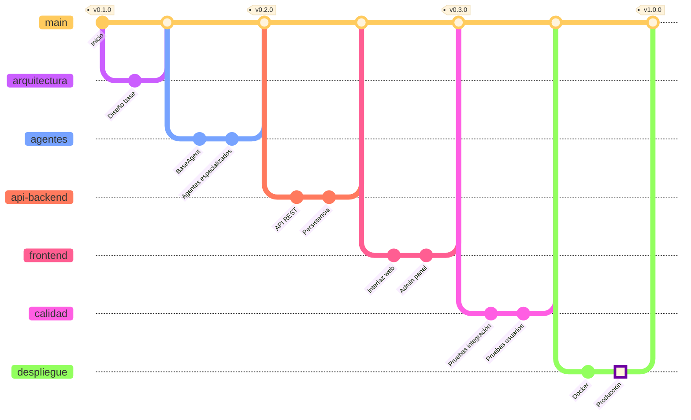

```mermaid
%%{init: { 'logLevel': 'debug', 'theme': 'base', 'gitGraph': {'showBranches': true, 'showCommitLabel':true}} }%%
gitGraph
    commit id: "Inicio" tag: "v0.1.0"
    branch arquitectura
    checkout arquitectura
    commit id: "Diseño base"
    checkout main
    merge arquitectura
    branch agentes
    checkout agentes
    commit id: "BaseAgent"
    commit id: "Agentes especializados"
    checkout main
    merge agentes tag: "v0.2.0"
    branch api-backend
    checkout api-backend
    commit id: "API REST"
    commit id: "Persistencia"
    checkout main
    merge api-backend
    branch frontend
    checkout frontend
    commit id: "Interfaz web"
    commit id: "Admin panel"
    checkout main
    merge frontend tag: "v0.3.0"
    branch calidad
    checkout calidad
    commit id: "Pruebas integración"
    commit id: "Pruebas usuarios"
    checkout main
    merge calidad
    branch despliegue
    checkout despliegue
    commit id: "Docker"
    commit id: "Producción" type: HIGHLIGHT
    checkout main
    merge despliegue tag: "v1.0.0"
``` 