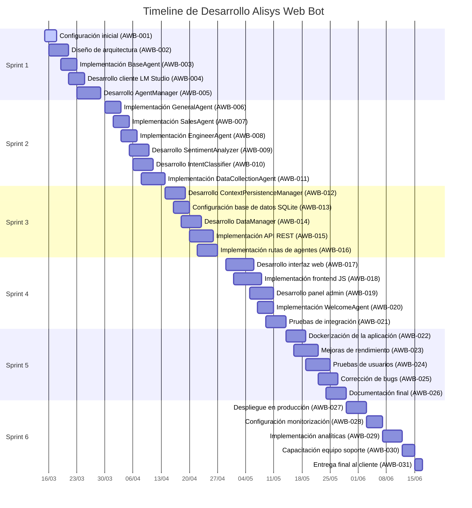
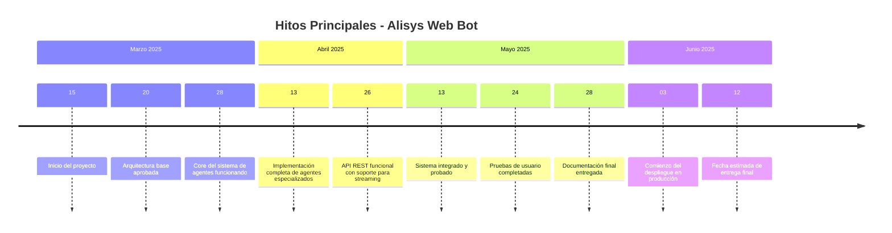
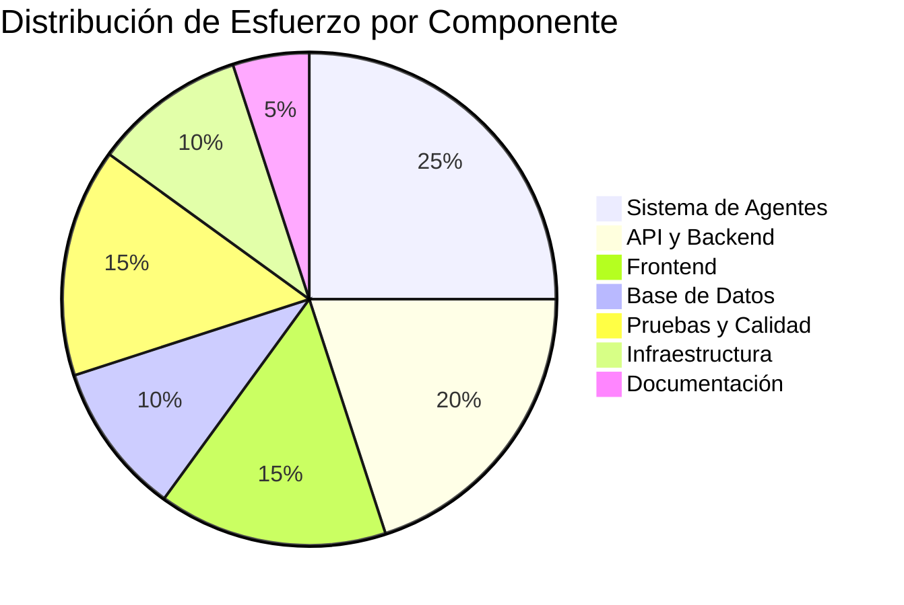
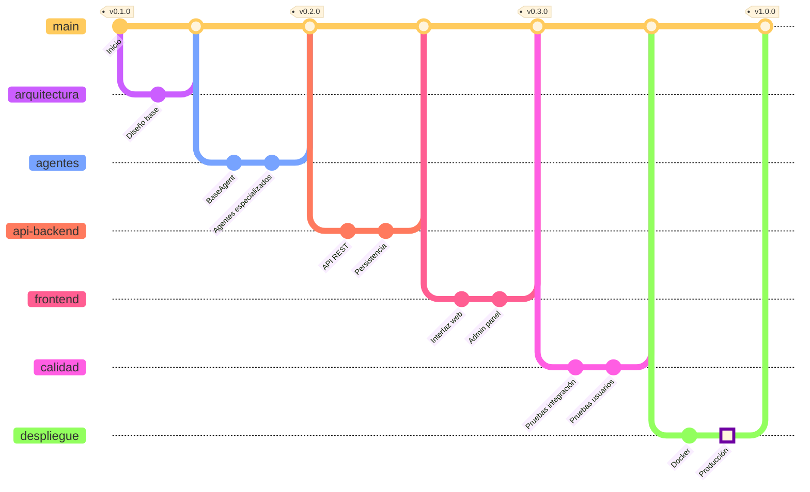

# Vista de Timeline - Proyecto Alisys Web Bot

## Diagrama de Gantt del Proyecto

## Timeline de Hitos del Proyecto

## Distribución de Cargas de Trabajo por Componente

## Progreso General del Proyecto

